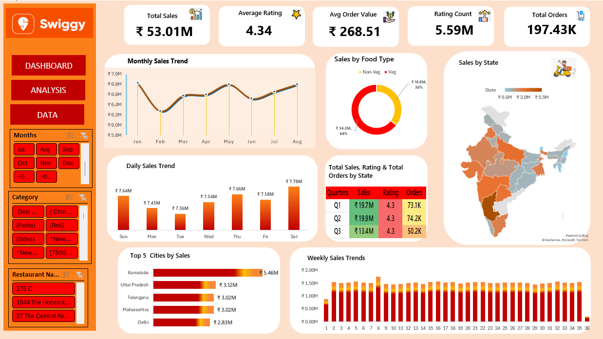

# Swiggy Sales Dashboard – Excel Project

## Overview
This project is an interactive Excel dashboard created to analyze Swiggy sales data.

## Sheets Included
- Dashboard – Main interactive dashboard
- Analysis – Detailed analysis sheet
- Data – Raw dataset

## Features
- KPI cards (Total Sales, Ratings, Orders)
- Monthly, weekly, and daily sales trends
- Sales by food category (Veg / Non-Veg)
- State-wise sales using map visualization
- Top cities by sales
- Interactive slicers and navigation buttons

## How to View
1. Download the Excel file
2. Open it using Microsoft Excel
3. Use Dashboard / Analysis / Data buttons for navigation

## Dashboard Preview

## Tools Used
- Microsoft Excel
- Pivot Tables
- Charts and Maps
- Slicers
